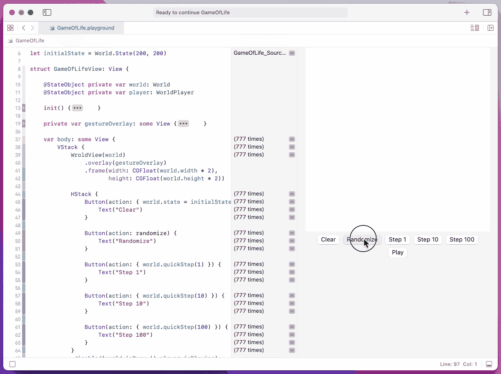

# Xcode Playground for Conway's Game of Life

## Compatibility
You need macOS 12 and Xcode 13 to run this Playground. If you are familiar with SwiftUI, you can get it to run on macOS 11 and Xcode 12 with simple modifications.

## Treasure
- [Cornell Math Explorers' Club](http://pi.math.cornell.edu/~lipa/mec/lesson6.html)
- [Wikipedia - Conway's Game of Life](https://en.wikipedia.org/wiki/Conway%27s_Game_of_Life)
- [Let’s BUILD a COMPUTER in CONWAY's GAME of LIFE](https://www.youtube.com/watch?v=Kk2MH9O4pXY)
